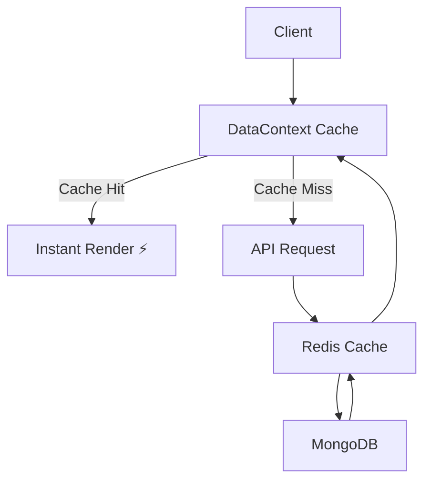

# 🚀 Starkk.shop — Next-Gen MERN E-Commerce Platform

<p align="center">
  
</p>


<p align="center">
  <b>⚡ Blazing Fast • 🧠 Smart Search • 🛒 Full-Stack Commerce • 🎯 Production Ready</b>
</p>

<p align="center">
  <a href="https://starkk.shop"></a>
  
  
  
</p>

---

## 🌐 Live Demo

👉 **https://starkk.shop**

---

## 🧠 Overview

**Starkk.shop** is a **high-performance, scalable MERN e-commerce platform** engineered with a focus on **speed, intelligent data flow, and seamless user experience**.

Unlike traditional e-commerce apps, Starkk is built with:

* ⚡ **Ultra-fast loading (cache-first architecture)**
* 🔍 **Smart search (Elasticsearch + MongoDB fallback)**
* 🧩 **Dynamic layout system (data-driven UI)**
* 📦 **Centralized state + caching (Redux + Context API)**

💡 This is not just a project — it's a **production-grade system design**.

---

## ✨ Key Features

### 🛍️ Core E-Commerce

* Dynamic product listings with layout engine
* Category-based filtering & smart browsing
* Cart & wishlist with persistent state
* Secure JWT-based authentication

### 🔍 Smart Search System

* Elasticsearch-powered search
* Trending & recent searches
* Intelligent suggestions (products, sellers, categories)

### ⚡ Performance First Architecture

* Centralized caching via `DataContext`
* Redux Toolkit global state management
* Stale-checking (prevents redundant API calls)
* Lazy loading + code splitting

### 🧑‍💼 Seller System

* OTP + password-based authentication
* Seller dashboard-ready backend
* Product management system

### 🧠 Intelligent Backend

* Optimized `/initial-data` endpoint
* Redis caching + background cache warming
* MongoDB indexing for high-speed queries
* Image sanitization + fallback system

---

## 🏗️ Tech Stack

### 🖥️ Frontend

* React.js
* Redux Toolkit
* Context API
* Tailwind CSS
* Framer Motion

### ⚙️ Backend

* Node.js
* Express.js
* MongoDB (Mongoose)
* Redis (Caching Layer)
* Elasticsearch (Search Engine)

### 🔐 Tools & Services

* JWT Authentication
* Axios
* Cloudinary

---

## 📂 Project Structure


```
starkkkk
├─ client
│  ├─ @
│  │  └─ components
│  │     └─ ui
│  │        ├─ button.tsx
│  │        ├─ card.tsx
│  │        ├─ checkbox.tsx
│  │        ├─ dialog.tsx
│  │        ├─ drawer.tsx
│  │        ├─ input.tsx
│  │        ├─ label.tsx
│  │        ├─ scroll-area.tsx
│  │        ├─ select.tsx
│  │        └─ slider.tsx
│  ├─ components
│  │  └─ common
│  │     ├─ FallbackImage.jsx
│  │     └─ Loader.jsx
│  ├─ components.json
│  ├─ eslint.config.js
│  ├─ index.html
│  ├─ lib
│  │  └─ utils.js
│  ├─ package-lock.json
│  ├─ package.json
│  ├─ postcss.config.js
│  ├─ public
│  │  └─ logo.png
│  ├─ README.md
│  ├─ src
│  │  ├─ App.jsx
│  │  ├─ assets
│  │  │  ├─ cod.png
│  │  │  ├─ delivery.png
│  │  │  ├─ images.jpeg
│  │  │  ├─ loading.gif
│  │  │  ├─ login-bg.webp
│  │  │  ├─ login.jpeg
│  │  │  ├─ logo.png
│  │  │  ├─ logo.webp
│  │  │  ├─ logoname.png
│  │  │  ├─ pngtree-cash-on-delivery-icon-png-image_6364044.png
│  │  │  ├─ profile.png
│  │  │  ├─ return.png
│  │  │  ├─ signn.webp
│  │  │  ├─ slogo.webp
│  │  │  ├─ slogooo.png
│  │  │  ├─ slogooo.webp
│  │  │  ├─ sslogo.png
│  │  │  ├─ top.avif
│  │  │  ├─ top.jpg
│  │  │  └─ vmig7kasls34evfbkz9f.jpg
│  │  ├─ axios.js
│  │  ├─ Components
│  │  │  ├─ admin
│  │  │  │  ├─ AdminAds.jsx
│  │  │  │  ├─ AdminCategories.jsx
│  │  │  │  ├─ AdminComboOffer.jsx
│  │  │  │  ├─ AdminLayout.jsx
│  │  │  │  ├─ AdminNavBar.jsx
│  │  │  │  ├─ AdminOrders.jsx
│  │  │  │  ├─ AdminOverview.jsx
│  │  │  │  ├─ AdminProducts.jsx
│  │  │  │  ├─ AdminSellers.jsx
│  │  │  │  ├─ AdminSponsoredProducts.jsx
│  │  │  │  └─ AdminUsers.jsx
│  │  │  ├─ axios.js
│  │  │  ├─ bottom.jsx
│  │  │  ├─ botttommm.jsx
│  │  │  ├─ CartProductCard.jsx
│  │  │  ├─ Category.jsx
│  │  │  ├─ CategoryCard.jsx
│  │  │  ├─ CategoryCardSkeleton.jsx
│  │  │  ├─ DraggableScrollbar.jsx
│  │  │  ├─ Filtermodel.jsx
│  │  │  ├─ home
│  │  │  │  ├─ CartSection.jsx
│  │  │  │  ├─ CategoryFilterBar.jsx
│  │  │  │  ├─ CategorySection.jsx
│  │  │  │  ├─ CategorySectionn.jsx
│  │  │  │  ├─ ComboOfferSection.jsx
│  │  │  │  ├─ DoubleAdd.jsx
│  │  │  │  ├─ GenderFilterBar.jsx
│  │  │  │  ├─ ProductSection.jsx
│  │  │  │  ├─ RecentlyViewedSection.jsx
│  │  │  │  ├─ SearchBar.jsx
│  │  │  │  ├─ SellerSection.jsx
│  │  │  │  ├─ SingleAdd.jsx
│  │  │  │  ├─ SkeletonSection.jsx
│  │  │  │  ├─ SponsoredSection.jsx
│  │  │  │  ├─ Topbox.jsx
│  │  │  │  ├─ TrendingSection.jsx
│  │  │  │  └─ TripleAdd.jsx
│  │  │  ├─ HorizontalProductRow.jsx
│  │  │  ├─ js.js
│  │  │  ├─ LoadingSpinner.jsx
│  │  │  ├─ magicui
│  │  │  │  └─ dock.tsx
│  │  │  ├─ Navbar.jsx
│  │  │  ├─ OrderConfirmation.jsx
│  │  │  ├─ OwnerCard.jsx
│  │  │  ├─ PageCacheProvider.JSX
│  │  │  ├─ ProductCard.jsx
│  │  │  ├─ ProductCard4line.jsx
│  │  │  ├─ ProductCardSkeleton.jsx
│  │  │  ├─ RelatedProducts.jsx
│  │  │  ├─ SearchBar.jsx
│  │  │  ├─ SearchResults.jsx
│  │  │  ├─ seller
│  │  │  │  ├─ NavBar.jsx
│  │  │  │  ├─ Orders.jsx
│  │  │  │  ├─ Overview.jsx
│  │  │  │  ├─ ProductForm.jsx
│  │  │  │  ├─ Products.jsx
│  │  │  │  ├─ Profile.jsx
│  │  │  │  └─ ProfileForm.jsx
│  │  │  ├─ selleraxios.js
│  │  │  ├─ SellerCard.jsx
│  │  │  ├─ SellerCardSkeleton.jsx
│  │  │  ├─ SellerProfileSkeleton.jsx
│  │  │  ├─ SkeletonSection.jsx
│  │  │  ├─ useraxios.js
│  │  │  └─ WishlistProductCard.jsx
│  │  ├─ context
│  │  ├─ DataProvider.jsx
│  │  ├─ ErrorBoundary.jsx
│  │  ├─ hooks
│  │  │  ├─ useAdminAuth.jsx
│  │  │  └─ useLazySection.jsx
│  │  ├─ i18next.js
│  │  ├─ index.css
│  │  ├─ Layout.jsx
│  │  ├─ lib
│  │  │  └─ utils.ts
│  │  ├─ main.jsx
│  │  ├─ Middleware
│  │  │  ├─ AdminProtectedRoute.jsx
│  │  │  └─ Protectedroute.jsx
│  │  ├─ Navbar.jsx
│  │  ├─ pages
│  │  │  ├─ AboutUs.jsx
│  │  │  ├─ AdminAuth.jsx
│  │  │  ├─ AdminDashboard.jsx
│  │  │  ├─ CancellationReturn.jsx
│  │  │  ├─ Cart.jsx
│  │  │  ├─ CategoryPage.jsx
│  │  │  ├─ CheckoutPage.jsx
│  │  │  ├─ ComboPage.jsx
│  │  │  ├─ FAQs.jsx
│  │  │  ├─ Home.jsx
│  │  │  ├─ LoginRegister.jsx
│  │  │  ├─ OrderConfirmation.jsx
│  │  │  ├─ OrderDetails.jsx
│  │  │  ├─ OwnerProfilePage.jsx
│  │  │  ├─ PrivacyPolicy.jsx
│  │  │  ├─ ProductDetails.jsx
│  │  │  ├─ ProductPage.jsx
│  │  │  ├─ SearchResults.jsx
│  │  │  ├─ SellerAuth.jsx
│  │  │  ├─ SellerDashboard.jsx
│  │  │  ├─ SellerOrders.jsx
│  │  │  ├─ SellerProducts.jsx
│  │  │  ├─ ShippingDelivery.jsx
│  │  │  ├─ TermsOfUse.jsx
│  │  │  ├─ UserDashboard.jsx
│  │  │  └─ WishlistPage.jsx
│  │  ├─ routes.jsx
│  │  ├─ selleraxios.js
│  │  ├─ services
│  │  │  └─ HomeAPI.js
│  │  ├─ store.js
│  │  ├─ useraxios.js
│  │  └─ utils
│  │     └─ authUtils.js
│  ├─ tailwind.config.js
│  ├─ tsconfig.json
│  └─ vite.config.js
├─ package-lock.json
├─ package.json
├─ README.MD
└─ server
   ├─ app.js
   ├─ config
   │  ├─ cloudinaryConfig.js
   │  ├─ db.js
   │  └─ multerConfig.js
   ├─ middleware
   │  ├─ adminLoggedin.js
   │  ├─ auth.js
   │  └─ userLoggedin.js
   ├─ models
   │  ├─ adminModel.js
   │  ├─ CategoryModel.js
   │  ├─ ComboOfferModel.js
   │  ├─ layoutModel.js
   │  ├─ orderModel.js
   │  ├─ productModel.js
   │  ├─ sellerModel.js
   │  ├─ SponsoredProductModel.js
   │  ├─ TempOrderModel.js
   │  └─ userModel.js
   ├─ package-lock.json
   ├─ package.json
   ├─ routes
   │  ├─ adminRouter.js
   │  ├─ category.js
   │  ├─ sellerRouter.js
   │  ├─ userRouter.js
   │  └─ userrr.js
   ├─ server.js
   └─ utils
      ├─ cache.js
      └─ otp.js

---

## ⚡ Performance Philosophy

> ⚡ “Speed is a feature.”

* 🚫 No unnecessary API calls
* 🧠 Smart cache invalidation
* ⚡ Instant navigation (no reload feel)
* 📦 Preloaded critical data (`/initial-data`)

---

## 🔄 Data Flow Architecture



---

## 🚀 Getting Started

### 1️⃣ Clone the Repository

```bash
git clone https://github.com/sharadhkr/stark.git
cd stark
```

### 2️⃣ Install Dependencies

```bash
cd frontend && npm install
cd ../backend && npm install
```

### 3️⃣ Setup Environment Variables

Create `.env` file in backend:

```env
MONGO_URI=your_mongo_uri
JWT_SECRET=your_secret
REDIS_URL=your_redis_url
ELASTIC_URL=your_elasticsearch_url
CLOUDINARY_URL=your_cloudinary_url
```

### 4️⃣ Run the Application

```bash
# backend
npm run dev

# frontend
npm start
```

---

## 🧪 Future Enhancements

* 🤖 AI-powered product recommendations
* 📱 Progressive Web App (PWA)
* 💳 Payment gateway integration
* 📊 Advanced analytics dashboard

---

## 🤝 Contributing

Contributions are welcome!
Fork the repo and submit a PR 🚀

---

## 👨‍💻 Author

**Sharad Rathore**
🚀 Full Stack Developer | Performance-Driven Engineer

---

## ⭐ Support

If you like this project:

👉 Star ⭐ the repo
👉 Share it with others

---

## ⚡ Final Note

> **“Starkk is not just an e-commerce app — it's a performance-engineered system.”**
